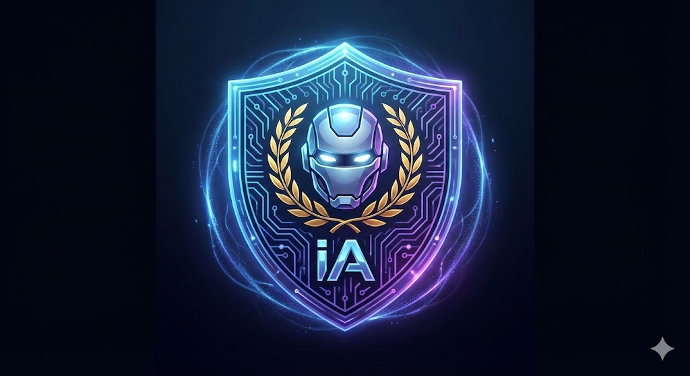
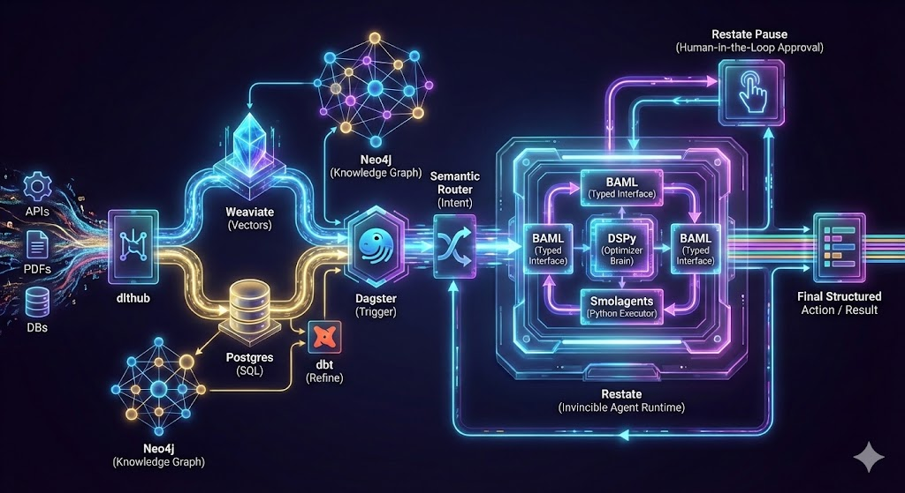
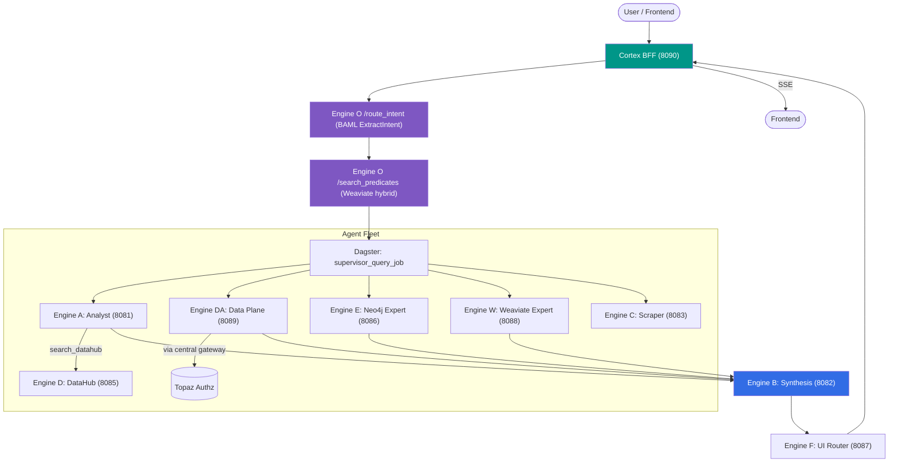
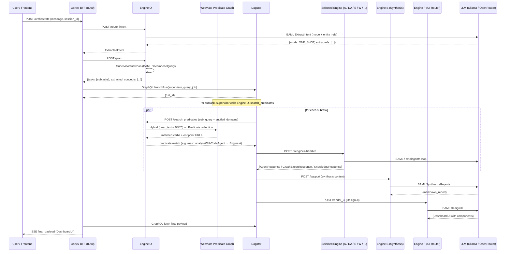

<p align="center">
  
</p>

<h1 align="center">Invincible Agent</h1>

<p align="center">
  <strong>Polyglot Agentic Data Mesh on Kubernetes</strong><br/>
  Decoupled FastAPI agent fleet · Dagster control plane · BAML grounding contracts
</p>

<p align="center">
  
  
  
  
  
</p>

---

## Architecture

<p align="center">
  
</p>

A strictly decoupled, polyglot microservice architecture where a **Dagster
control plane** orchestrates an **agent fleet** of independent FastAPI pods
on Kubernetes. Each engine has its own isolated codebase, OCI image, and
K8s Service. Inter-service contracts are BAML-typed and routing decisions
are predicate-graph driven (ADR-0004).

### Cortex BFF (user-facing entry point)
`iagent-cortex-bff` on port 8090. Synchronous entry point for the mesh.
Accepts a user query, calls Engine O for intent extraction + planning,
launches a Dagster `supervisor_query_job`, polls for completion, and
streams the final UI instruction back via Server-Sent Events.

### Dagster Control Plane
Ephemeral, lightweight pods. Uses only the `requests` library to trigger
agents via internal K8s URLs. Does **not** use `PipesK8sClient`. The
supervisor is dynamic per query — it builds a task plan from Engine O's
`/route_intent` + `/search_predicates` output and fans out to the engines
chosen by the predicate graph.

### Agent Fleet

| Engine | Framework | Port | Primary Endpoint | Role |
|--------|-----------|------|------------------|------|
| **O** | rdflib + Weaviate + BAML | 8084 | `/route_intent`, `/resolve`, `/plan`, `/search_predicates`, `/find_tool`, `/find_path` | Ontology + predicate-graph router. Subject grounding via RDF; engine selection via Weaviate predicate graph (ADR-0004). |
| **A** | Restate + smolagents | 8081 | `/analyze` | Durable analyst with code-agent loop. Calls `search_datahub`, `superset_analytics_manager`, and JIT-bound tools discovered through DataHub. |
| **B** | LangGraph + Postgres | 8082 | `/support` | Stateful synthesis & follow-up dialog. Conversational memory via `AsyncPostgresSaver`. |
| **C** | Swarms.ai | 8083 | `/scrape` | Stateless heavy-compute extraction. |
| **D** | httpx + DataHub GMS | 8085 | `/query_metadata`, `/find_tools`, `/dynamic_context` | Catalog wrapper. Returns enriched assets (owner, lineage, freshness, tags, schema). See ADR-0013 for the planned capability-tool generalization. |
| **DA** | Restate + smolagents + Polars | 8089 | `/analyze` | Universal data plane. Reads Postgres / ClickHouse / S3 Parquet / Delta / Iceberg via CortexDataClient with Topaz-enforced RLS/CLS. |
| **E** | Restate + smolagents + Neo4j + mem0 | 8086 | `/query_proxy`, `/restate/Neo4jExpertService/*` | Knowledge-graph expert. Executes Cypher, persists successful queries to mem0 for long-term episodic memory. |
| **F** | FastAPI + BAML | 8087 | `/render_ui` | Presentation router. Maps agent text into one of six `DashboardUI` archetypes. See ADR-0012 for the planned dynamic-column refactor. |
| **W** | Restate + smolagents + Weaviate | 8088 | `/query_knowledge` | Semantic knowledge expert. Hybrid `near_text` search over technical manuals with strict per-domain segregation. |

Supporting infrastructure: PostgreSQL, Restate, Neo4j, Weaviate, Fuseki
(SPARQL), Keycloak (identity), Topaz (authorization), MinIO, ClickHouse,
DataHub GMS, OpenSearch, Redpanda — all deployed via the unified Helm
chart in `helm/invincible-agent`.

### Data Flow



### Query Execution Flow



This is ADR-0004's predicate-graph routing applied per subtask. Engine O
no longer hardcodes "what calls what" — engines self-register their
verbs into Weaviate at startup (`register_engine_to_mesh`), and the
supervisor looks up the right engine per subtask via hybrid vector
search filtered by the caller's `entitled_domains` claim from Keycloak.

---

## Access Control — authorization between retrieval and synthesis

Agentic systems leak because they authorize the **action**, not the **content
the model sees**. An agent with tool access can be prompted — by injection,
jailbreak, or ordinary ambiguity — into surfacing data the caller was never
cleared for, because the permission check happens at the *tool call*, not on
the *content flowing back through it*. [MCP](https://modelcontextprotocol.io/)
standardizes **how** agents reach tools and data; it does not govern **which
content within a response** a given caller may see. That layer — above the
tool-access model — is where this system enforces, and it is the differentiator.

**The gate sits between retrieval and synthesis.** The model never receives
content the caller isn't authorized to see, so it *cannot* surface it —
regardless of prompt, jailbreak, or model behavior. Enforcement is by
construction, not by trusting the model:

- **Content-level, pre-synthesis.** Each engine filters retrieved rows /
  document chunks / graph nodes / ontology classes against the caller's grants
  **before** the model synthesizes — the model is handed only the authorized
  subset. (Data rows via the central-gateway/Topaz gate; document chunks via
  Engine W's before-synthesis result-filter; graph content via Engine E; the
  ontology-class candidate pool via Engine O.)
- **Deny-by-default, explicit per-asset grants.** A caller reads an asset only
  via an *explicit, auditable* grant (owner, or an asserted `reader`/`viewer`
  relation). Entitlement / persona / domain are *eligibility* (necessary),
  never the grant (sufficient) — need-to-know, not clearance-implies-access.
- **Deny-by-construction where the surface is dangerous.** The graph-query
  interface is a bounded, Cypher-flavored API, not free-text Cypher: unsafe
  queries are *inexpressible*, not filtered-after — there is no parser at the
  security boundary to be incomplete.
- **Single decider.** One authorization authority ([Topaz](https://www.topaz.sh/),
  ReBAC); every enforcement point *asks* and honors the answer — no policy
  predicate in application code, no drift between where a decision is made and
  where it's enforced.
- **Compartment / classification-ready as a deployment overlay.** The same
  system runs unclassified or fully-classified by config. Compartment
  assignment and the default-for-unassigned are per-deployment *overlay*, not
  code — a classified deployment can compartment the entire vocabulary and make
  the ontology itself secret, with no rewrite.

Designed to be **certifiable**: enforcement lives at the data / query layer,
provable to a reviewer by reading a bounded surface, rather than resting on an
application-completeness claim. The gates are proven by **discriminating,
composed-path seals** on live data, both directions — an authorized caller sees
exactly their granted content, the ungated content is dropped *before
synthesis*, and a different caller is denied. (All four content gates —
data-plane, document, graph, and ontology-class — are sealed; per-gate status
and the seal evidence are in the architecture doc. Enforcement is dark-launched
behind a flag that flips last, after every engine's gate is proven.)

> **How it works** →
> [`docs/architecture/authorization.md`](docs/architecture/authorization.md)
> (the topology of who *decides* / *asks* / *informs*, the cross-repo boundary
> contracts, and the invariants). **The decisions** →
> [`docs/adr/`](docs/adr/) (ADR-0025 instance-plane access control, ADR-0026
> persona/entitlement authorization).

---

## Tech Stack

| Layer | Technology | Purpose |
|-------|-----------|---------|
| **Orchestration** | Dagster 1.12.x | Supervisor jobs, asset materializations for observability |
| **API Layer** | FastAPI + uvicorn / hypercorn | Universal wrapper for every agent framework |
| **Contracts** | BAML 0.219.x | Type-safe LLM input/output shared across agents |
| **Identity** | Keycloak + JWT | OAuth2 password-grant for users, client_credentials for M2M |
| **Authorization** | Topaz (ReBAC) | Single-decider, deny-by-default access control enforced **between retrieval and synthesis** (content-level, not just tool-level) — see [Access Control](#access-control--authorization-between-retrieval-and-synthesis) |
| **Engine A / DA / E / W** | Restate SDK + smolagents | Durable code-agent loops |
| **Engine B** | LangGraph + AsyncPostgresSaver | Stateful synthesis + follow-up turns |
| **Engine C** | Swarms.ai | High-concurrency extraction |
| **Engine F** | BAML DesignUI | Persona-aware UI archetype routing (ADR-0012) |
| **Ontology** | rdflib + Fuseki (SPARQL) | IOF/MIMOSA + per-domain TTL fragments |
| **Predicate Routing** | Weaviate v4 hybrid search | Engine self-registration + verb lookup (ADR-0004) |
| **Catalog** | DataHub v1.6.0 GMS | Datasets, dashboards, charts, lineage, ownership |
| **Data Plane** | CortexDataClient + Polars | Universal reader: Postgres / ClickHouse / S3 Parquet / Delta / Iceberg |
| **Knowledge Graph** | Neo4j 5.x | Domain-segregated graph for Engine E |
| **Memory** | mem0 + Weaviate | Long-term episodic memory across pod restarts |
| **Containers** | Multi-stage Docker + `uv sync --frozen` | Dynamic Dockerfile per agent, built in CI |
| **Infra** | Kubernetes + Helm + Rancher | Single `helm install iagent` deploys the full stack |

---

## Project Structure

```
src/iagent/
  definitions.py              # Dagster entry point (auto-loads defs/)
  gateway.py                  # Cortex BFF FastAPI gateway (port 8090)
  defs/
    agent_routers.py          # Dagster @asset HTTP dispatchers
    dynamic_factory.py        # Dynamic BPMN factory (reads bpmn_catalog)
    dynamic_supervisor.py     # Multi-subtask fan-out/fan-in for queries
  auth.py                     # Keycloak JWT verification + persona/domain claims
agent_fleet/
  ontology_service/           # Engine O (port 8084) — RDF + Weaviate predicate routing
  restate_analyst/            # Engine A (port 8081) — code-agent loop with JIT tools
  langgraph_support/          # Engine B (port 8082) — synthesis & memory
  swarms_scraper/             # Engine C (port 8083) — extraction
  datahub_wrapper/            # Engine D (port 8085) — catalog wrapper
  data_analyst/               # Engine DA (port 8089) — Polars + CortexDataClient
  neo4j_expert/               # Engine E (port 8086) — Cypher + mem0
  presentation_agent/         # Engine F (port 8087) — DesignUI archetype router
  weaviate_expert/            # Engine W (port 8088) — semantic manual retrieval
  utils/                      # Shared mesh-registration, weaviate helpers
  core/                       # authz dependency, topaz client
  llm_utils.py                # Shared LLM model factory (LiteLLM / OpenAIServerModel)
baml_shared/
  baml_src/
    contracts.baml            # SOURCE OF TRUTH for all inter-service schemas
    generators.baml           # Codegen to Python (Pydantic) + TypeScript
  baml_client/                # Generated — DO NOT EDIT
baml_client_ts/               # Generated — frontend client
docs/
  adr/                        # Architecture decision records (ADR-0001..0013)
helm/invincible-agent/        # Helm chart (one release deploys the whole stack)
scripts/
  seed_sandbox_predicates.py  # Seed Weaviate Predicate collection
  seed_weaviate_manuals.py    # Seed Engine W's DocumentChunk collection
  seed_datahub_catalog.py     # Seed DataHub catalog (datasets, dashboards, lineage)
tests/
  sandbox_e2e/                # End-to-end tests through cortex-bff /orchestrate
  test_*.py                   # Pytest unit/mock tests
```

---

## Shared Data Contracts (BAML)

All inter-service communication uses schemas defined in `contracts.baml`:

| Schema | Description |
|--------|-------------|
| `AgentTask` | Universal input — task_description, dataset_id, semantic_context? |
| `AgentResponse` | Universal output — status, summary, extracted_metrics, structured_data |
| `SemanticResolution` | Ontology grounding — resolved_uri (dynamic, from RDF), confidence_score |
| `ExtractedIntent` | Mode (ONE_SHOT / CONVERSATIONAL) + entity_refs |
| `SupervisorTaskPlan` | List of subtasks, each with persona + sub_query |
| `GraphExpertResponse` | Engine E response — persona-typed union |
| `KnowledgeResponse` | Engine W response — markdown summary + cited documents |
| `DashboardUI` | Engine F output — array of typed UI components |
| `DesignUI` | BAML function: `(raw_data, persona) → DashboardUI` |
| `ClassifyDomainIntent` | BAML function: dynamic ontology-URI classification |
| `ExtractIntent` | BAML function: mode + entity_refs from user query |

Ontology classes are **never hardcoded enums** — they are dynamically
injected at runtime from the RDF graph via `active_ontology_classes`.
Personas and domains are likewise dynamic. See ADR-0009 for the
classification-axes sunset that simplified this layer.

---

## UI Archetypes

Engine F returns a `DashboardUI` containing one or more typed components.
Six archetypes are defined:

| Archetype | Layout | Frontend Renderer | Notes |
|-----------|--------|-------------------|-------|
| `PROCESS_TOPOLOGY` | Full-width | React Flow graph | Nodes + edges |
| `HAZARD_DECLARATION` | 2-col grid | WarningCard | Severity badges |
| `ASSET_STATE_METRIC` | 2-col grid | SupplyTable | id/name/type/description |
| `KNOWLEDGE_DOCUMENT` | Full-width | `react-markdown` | Prose answers |
| `CHART_WIDGET` | Inline | Recharts | BAR / LINE / PIE / SCATTER |
| `DIGITAL_TWIN_3D` | Full-width | three.js scene | Element-level diagnostics |

**Known limitation (tracked in ADR-0012):** the four-column `MetricUI`
schema for `ASSET_STATE_METRIC` is too rigid for catalog Q&A. Today,
Engine F's BAML grounding rules steer catalog Q&A toward
`KNOWLEDGE_DOCUMENT` to preserve owner/lineage/freshness as text;
the proposed long-term fix is a dynamic-columns refactor.

---

## Design Principles

1. **Strict Decoupling** — Each engine is an isolated pod with its own
   codebase and OCI image. No cross-engine framework imports. Dagster
   never imports an agent SDK.
2. **FastAPI Everywhere** — Universal API wrapper across every agent
   framework. The framework lives inside the pod; the wire protocol is
   always HTTP + JSON.
3. **BAML as Interface** — Type-safe contracts shared across the entire
   mesh. Tool docstrings inside engines are also part of the contract
   surface (see ADR-0013 for why this matters).
4. **Ontology-First Grounding** — Subjects and concepts the user asks
   about are resolved through the IOF/MIMOSA RDF knowledge graph
   (Engine O `/resolve`) before any agent executes. The agent receives
   `semantic_context.resolved_uri` and treats it as ground truth.
   *Engine selection* (which agent runs which subtask) is performed via
   Weaviate's Predicate graph populated from agent self-registration
   (ADR-0004), with verbs drawn from the RDF-validated namespace
   (ADR-0005). The RDF graph is the *vocabulary*; the predicate graph
   is the *router*.
5. **Durable by Default** — Engine A / DA / E / W wrap their LLM and
   side-effect calls in Restate `ctx.run()` for exactly-once execution
   across pod restarts.
6. **Stateful When Needed** — Engine B uses Postgres-backed
   `AsyncPostgresSaver` checkpoints for conversational memory across
   turns. Engines A/DA/E persist long-term episodic memory in mem0
   backed by Weaviate.
7. **Multi-stage Docker via `uv`** — Each engine has a dynamic
   Dockerfile generated in CI. `uv sync --frozen` resolves dependencies
   from the engine's pinned lockfile. No Dockerfiles in the repo
   root; no Cloud Native Buildpacks (the old Paketo path was
   superseded — see development log for the migration).
8. **Dagster as Router** — Pure HTTP dispatch via `requests`. No
   `PipesK8sClient`. The supervisor job is dynamic; each subtask
   maps to a `/search_predicates` lookup and an HTTP POST.
9. **Imperative-Declarative Hybrid** — Dynamic BPMN workflows use ops
   for control flow and `AssetMaterialization` for data lineage.

---

## Architecture Decision Records

Every load-bearing architectural decision is captured in
[`docs/adr/`](docs/adr/). The current set:

| ADR | Subject |
|-----|---------|
| [0001](docs/adr/ADR-0001-mem0-llm-decouple.md) | Decouple mem0 LLM from agent inference LLM |
| [0002](docs/adr/ADR-0002-mem0-monkeypatches.md) | mem0 monkeypatches policy |
| [0003](docs/adr/ADR-0003-llm-rightsizing.md) | LLM right-sizing per engine |
| [0004](docs/adr/ADR-0004-predicate-graph-routing.md) | **Predicate-graph routing** (the current router) |
| [0005](docs/adr/ADR-0005-verb-and-concept-namespaces.md) | Verb + concept namespaces |
| [0006](docs/adr/ADR-0006-verb-registry-location.md) | Verb registry location |
| [0007](docs/adr/ADR-0007-survey-before-mint.md) | Survey before minting new concepts |
| [0008](docs/adr/ADR-0008-routing-fallback-policy.md) | Routing fallback policy |
| [0009](docs/adr/ADR-0009-sunset-classification-axes.md) | **Sunset of legacy classification axes** |
| [0010](docs/adr/ADR-0010-distributed-tracing-strategy.md) | Distributed tracing strategy |
| [0011](docs/adr/ADR-0011-multi-spo-routing.md) | Multi-SPO routing (deferred design) |
| [0012](docs/adr/ADR-0012-ui-archetype-rigidity.md) | **UI archetype rigidity** (deferred fix) |
| [0013](docs/adr/ADR-0013-engine-d-capability-surface.md) | **Engine D capability surface** (deferred fix) |

Bold rows are decisions that have already shaped the current
implementation. Non-bold rows are explorations or deferred decisions.

---

## Getting Started

### Prerequisites

- Python 3.12 (each engine pins `requires-python = ">=3.12,<3.13"`)
- [uv](https://docs.astral.sh/uv/) — used by every engine's build
- Docker (for local container builds matching CI)
- `kubectl` + `helm` if deploying to a cluster

### Install Dependencies

```bash
uv sync
```

Each engine under `agent_fleet/` has its own `pyproject.toml` and
`uv.lock`. CI builds each engine from its own lockfile; for local dev
the root `uv sync` is sufficient for orchestrator-side work.

### Regenerate BAML Client

After modifying `baml_shared/baml_src/contracts.baml`:

```bash
cd baml_shared
uv run --no-project --with baml-py==0.219.0 baml-cli generate --from baml_src
```

This regenerates both the Python client (`baml_shared/baml_client/`)
and the TypeScript client (`baml_client_ts/baml_client/`) used by the
frontend.

### Run Dagster Locally

```bash
dg dev
```

Open <http://localhost:3000>. The asset graph shows the dynamic
supervisor jobs generated from the predicate graph + bpmn_catalog.

### Run Engine Services Locally

Each engine runs independently. From the repo root:

```bash
# Engine O — Ontology + predicate router
uvicorn agent_fleet.ontology_service.main:app --port 8084

# Engine A — Restate analyst
uvicorn agent_fleet.restate_analyst.main:app --port 8081

# Engine DA — Data plane analyst
uvicorn agent_fleet.data_analyst.main:app --port 8089

# Engine F — Presentation router
uvicorn agent_fleet.presentation_agent.main:app --port 8087

# Engine W — Semantic knowledge expert
uvicorn agent_fleet.weaviate_expert.main:app --port 8088

# ... etc
```

Engine A, DA, E, W are Restate-durable — for full durability they need
a Restate server running and themselves registered as Restate
deployments. For local single-shot testing the FastAPI proxy routes
(`/analyze`, `/query_proxy`, `/query_knowledge`) exercise the same
code path without durability guarantees.

---

## Containerization

Each engine is built as an OCI image via a **dynamic multi-stage
Dockerfile** generated in the CI workflow
(`.github/workflows/build-containers.yml`). The build uses `uv` to
resolve dependencies from the engine's pinned lockfile:

```dockerfile
COPY --from=ghcr.io/astral-sh/uv:latest /uv /uvx /bin/
COPY ${AGENT_DIR}/pyproject.toml ${AGENT_DIR}/uv.lock ./
RUN --mount=type=cache,target=/root/.cache/uv \
    uv sync --frozen --no-dev --no-install-project --compile-bytecode
```

The matrix step builds one image per engine. No Dockerfiles are
checked into the repo root — they are generated and discarded per
build. (We migrated from Cloud Native Buildpacks to this pattern; see
the development log entries for the reasoning.)

---

## Kubernetes Deployment (Helm)

A single Helm chart deploys the whole stack:

```bash
helm install iagent ./helm/invincible-agent \
  -f helm/invincible-agent/values-sandbox.yaml
```

The chart provisions every engine plus the supporting infrastructure
(Postgres, Restate, Neo4j, Weaviate, Fuseki, Keycloak, Topaz, MinIO,
ClickHouse, DataHub GMS, OpenSearch, Redpanda). Each component can be
disabled via `<component>.enabled: false` or pointed at an external
instance via `external<Component>` values.

The sandbox values file at `helm/invincible-agent/values-sandbox.yaml`
shows a minimal-resource deployment suitable for development clusters.
**Note:** the chart's default Restate image tag is `1.1` which has
drifted on Docker Hub — sandbox pins to `1.6.2` for compatibility with
the data directory format. Always pin Restate explicitly.

---

## Cluster Service Discovery

Inside the cluster, engines are reached by service name:

| Engine | Internal URL |
|--------|-------------|
| Cortex BFF | `http://iagent-cortex-bff:8090/orchestrate` |
| Engine O | `http://iagent-engine-o:8084/route_intent` |
| Engine A | `http://iagent-engine-a:8081/analyze` |
| Engine B | `http://iagent-engine-b:8082/support` |
| Engine C | `http://iagent-engine-c:8083/scrape` |
| Engine D | `http://iagent-engine-d:8085/query_metadata` |
| Engine DA | `http://iagent-data-analyst:8089/analyze` |
| Engine E | `http://iagent-engine-e:8086/query_proxy` |
| Engine F | `http://iagent-engine-f:8087/render_ui` |
| Engine W | `http://iagent-engine-w:8088/query_knowledge` |

All engines expose `GET /health` for liveness probes.

---

## Environment Variables

The most load-bearing variables; not exhaustive:

| Variable | Service | Purpose |
|----------|---------|---------|
| `BPMN_POSTGRES_*` | Dagster | Postgres for the BPMN catalog |
| `LANGGRAPH_POSTGRES_URI` | Engine B | Conversational memory checkpointer |
| `WEAVIATE_HTTP_HOST`, `WEAVIATE_GRPC_HOST` | Engine O / W | Predicate graph + manual index |
| `OLLAMA_BASE_URL` | All engines | Local LLM endpoint (gpt-oss / nomic-embed-text) |
| `SMOLAGENTS_PROVIDER`, `SMOLAGENTS_MODEL` | A / DA / E / W | LLM provider selection |
| `KEYCLOAK_REALM_URL` | BFF / DA central gateway | OAuth2 verification |
| `DATAHUB_GMS_URL`, `DATAHUB_TOKEN` | Engine D | DataHub GMS endpoint |
| `DATAHUB_WRAPPER_URL` | Engine A | Endpoint of Engine D, used by `search_datahub` tool |
| `RESTATE_INGRESS_URL` | A / DA / E / W | Restate ingress for durable invocation |
| `MESH_REGISTER_ON_STARTUP` | All engines | Opt-in self-registration with the central gateway |
| `MESH_DEV_TOKEN` | CortexDataClient | Dev-mode JWT for the data plane |

See each engine's `pyproject.toml` and the helm chart for the
complete set.

---

## Testing

Two categories:

- **`tests/`** — pytest unit / mock-style tests. Run against in-process
  fakes; no cluster required.
  ```bash
  uv run pytest tests/
  ```
- **`tests/sandbox_e2e/`** — end-to-end tests that fire through the
  deployed `cortex-bff /orchestrate` against the real sandbox mesh.
  Each test gets a real Keycloak JWT and consumes the SSE stream from
  the actual engines. Requires a running sandbox cluster and the seed
  scripts in `scripts/` to have populated Weaviate and DataHub.
  ```bash
  uv run tests/sandbox_e2e/test_engine_w_knowledge.py
  uv run tests/sandbox_e2e/test_engine_d_datahub_suite.py
  ```
  See `tests/sandbox_e2e/README.md` for the port-forward setup.

---

## Additional Documentation

| File | Purpose |
|------|---------|
| [`llms.txt`](llms.txt) | AI-readable project index and development log |
| [`.cursorrules`](.cursorrules) | Coding style + tech stack constraints |
| [`AGENTS.md`](AGENTS.md) | AI agent workflow rules, safety boundaries, phase log |
| [`baml_shared/baml_src/contracts.baml`](baml_shared/baml_src/contracts.baml) | BAML contracts — single source of truth |
| [`docs/adr/`](docs/adr/) | Architecture decision records (ADR-0001..0013) |
| [`tests/sandbox_e2e/README.md`](tests/sandbox_e2e/README.md) | End-to-end test harness |

---

## Learn More

- [Dagster Documentation](https://docs.dagster.io/)
- [BAML Documentation](https://docs.boundaryml.com/)
- [Restate Documentation](https://docs.restate.dev/)
- [smolagents Documentation](https://huggingface.co/docs/smolagents/)
- [LangGraph Documentation](https://langchain-ai.github.io/langgraph/)
- [DataHub Documentation](https://datahubproject.io/docs/)
- [Weaviate Documentation](https://weaviate.io/developers/weaviate)
- [Topaz Documentation](https://www.topaz.sh/docs)
